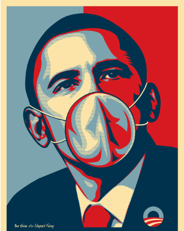

# Privilege_Kit

Yes we can!

## Summary
This is a rootkit and privilege escalation kit for Linux(Ubuntu) and MacOS.

We need this in conjunction with CryptoWolf/WannaDie because exploits are hard. If we set the bar low enough that we just need to run one time on the user system, we can eventually escalate privilege the next time our victim uses the sudo command. 

There might eventually be other fun stuff added to this, but for now it's just designed to elevate privilege, fuck over the root account and execute our payload.

## Usage
To create a custom payload, modify the sudo script on the lines designated for the payload. Convert it to base64 and re-insert into privkit.sh.

To actually deploy the script on a linux system using bash or MacOS, simply run the payload as an unprivileged user who has sudo.

Example: ./privkit.sh h

The h is there to ensure the script is not deployed by accident.

Now just patiently wait for the user to sudo at some point in the future and your payload will be deployed as root. No 0day required!
